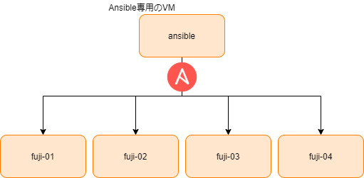

= 1富士2鷹3茄子

== VagrantBoxを追加し、VMをたちあげて、プロビジョニングするまで

----
$ make pull-boxes
$ make init-plugin
$ make up
$ make provision-provision
----

== たてたVMにsshして、Dockerのバージョン確認するまで

----
$ make ssh-fuji-01
(VM内で)
$ docker --version
----
