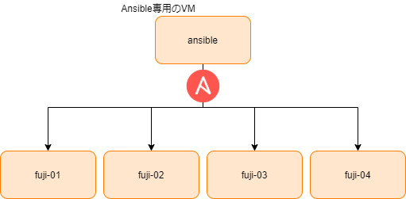

= 1富士2鷹3茄子

== VagrantBoxを追加し、VMをたちあげて、プロビジョニングするまで

----
$ make setup-ytt
$ make pull-boxes
$ make install-plugin
$ vagrant up
$ make provision-development
----

==== Ansibleのプロパティやregisterなどの挙動をチェックするトライ&エラー用のMake

----
$ make provision-debug
----

== たてたVMにsshして、Dockerのバージョン確認するまで

----
$ make ssh VM_KEY=fuji-01
(VM内で)
$ docker --version
----

== Help

----
$ make help
######################################################################
# Makeタスク一覧
# $ make XXX
# or
# $ make XXX --dry-run
######################################################################
install-plugin       VagrantでたてたVM同士が名前解決するプラグインを入れる
pull-boxes           vagrant box add 色々
setup-vagrant-keys   VMの秘密鍵をtmp/以下に持っていき、400にする
ssh-ansible          ansible用のvmにssh(デバッグ用)
ssh                  VM_KEYに対応したvmへssh($ make ssh VM_KEY=fuji-01)
setup-ytt            yttのインストール
uninstall-ytt        yttのアンインストール
help                 Make タスク一覧
----
